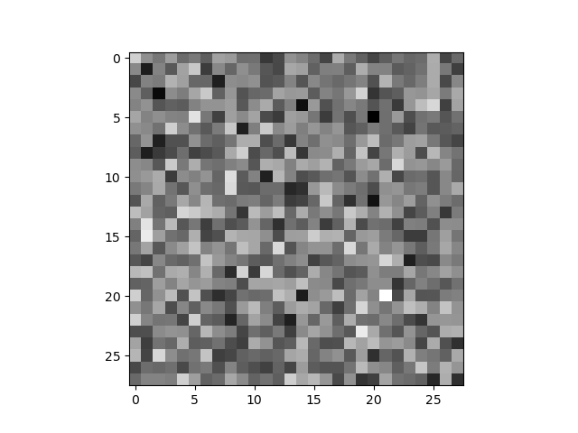
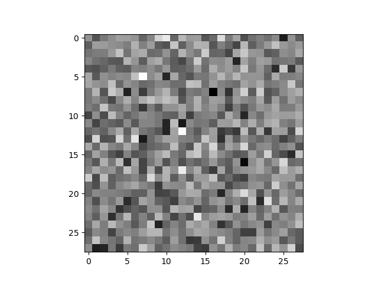

# DataMing_A1

## Project title "Construct an Image from the Gaussian noise by the Diffusion Model"  

### Group  
Kuang Wenwei (3036033792)  
Wei Tianqi (3036081804)  
Chen siwei (3036031823)  
Li Dongheng(3036034875)  


### Our experiment code and explaination are in code.ipynb  

If you don't want to train the noise estimated model, you could load the weight in code.ipynb as following.  

Remember to change the **path of weight**. 

```
model = Unet(dim=18,channels=1,dim_mults=(1,2,4),resnet_block_groups=6).to(device)
model.load_state_dict(torch.load("/kaggle/input/models/weights.pth")['state_dict'])
```

### Results  


